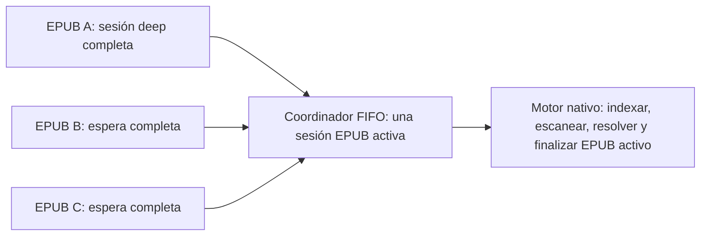
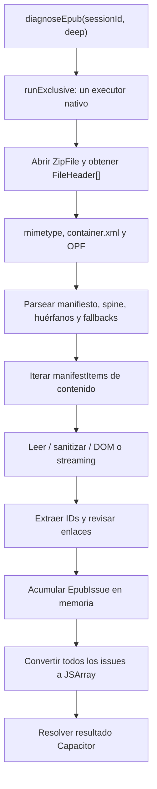
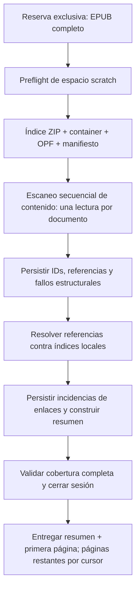

# PRD — Diagnose deep EPUB Android: cobertura completa, velocidad y memoria acotada

**Producto:** EPUB Cover Changer (ECC), EPUB Fixer (EF) y EPUB Merger & Splitter (EMAS) Android  
**Estado:** Propuesto  
**Ámbito:** motor central `epub-rewrite`, `file-kit` y consumidores Android  
**Decisión de concurrencia:** la unidad secuencial es el **EPUB completo**. Un diagnóstico deep no se divide en trabajos independientes por XHTML, imagen, enlace o entrada ZIP. Un EPUB activo conserva la exclusividad hasta terminar, cancelar o fallar.

## 1. Resumen

El diagnóstico deep debe inspeccionar por completo un EPUB, incluso cuando es grande, contiene decenas de miles de documentos XHTML o pesa hasta 2 GiB. El límite temporal, de entradas, bytes o enlaces no es aceptable: no puede convertir una inspección incompleta en un resultado final ni ocultar los hallazgos obtenidos.

La implementación actual ya ejecuta el trabajo nativo en un único `ExecutorService` y serializa llamadas de diagnóstico en cada servicio TypeScript. Sin embargo, dentro de un diagnóstico se repiten operaciones costosas: búsquedas lineales en la central ZIP, lecturas adicionales para resolver fragmentos, creación de DOM completos, copias de texto sanitizado, dos recorridos de algunos documentos grandes y acumulación sin límite de hallazgos e índices de IDs en memoria.

Este PRD sustituye ese comportamiento por una sesión de diagnóstico por EPUB, con índices de acceso constante, un escáner de contenido con memoria acotada, persistencia temporal local de índices y hallazgos, y resultados paginados. La cobertura de reglas no se reduce: se preservan todos los códigos de diagnóstico actuales y se conserva cada ocurrencia encontrada.

## 2. Contexto y evidencia

El EPUB de referencia `Biblia_20260806_003745_20260807_193900_20260808_114210_merged.epub` contiene aproximadamente:

| Dato | Valor observado |
| --- | ---: |
| Tamaño comprimido | 27,451,337 bytes |
| Entradas ZIP | 13,493 |
| Documentos XHTML/HTML | 13,458 |
| Tamaño descomprimido total | 73,903,886 bytes |
| Recorrido antes del antiguo corte temporal | 7,666 documentos en 90,036 ms |

Ese caso no era evidencia de un EPUB irreparable. El diagnóstico se detenía antes de terminar por el presupuesto temporal. Tras eliminar los límites globales, el motor debe terminar la cobertura; ahora hace falta recuperar velocidad sin reintroducir ningún corte artificial ni aumentar el riesgo de OOM.

## 3. Problema a resolver

### 3.1 Problema de producto

Una persona selecciona un EPUB esperando un diagnóstico definitivo: válido, reparable o no compatible. Un resultado debe representar todo el archivo, no una fracción de su contenido. Si el análisis tarda, la aplicación debe mostrar progreso real, permitir cancelación y conservar los hallazgos existentes; no debe degradar silenciosamente a un análisis rápido ni concluir que el archivo está bien.

### 3.2 Problema técnico

El deep actual tiene una complejidad y presión de memoria innecesarias:

- `findHeader(List<FileHeader>, path)` recorre linealmente la lista ZIP. Se invoca durante análisis de manifiesto, lectura de documentos, resolución de destinos y recolección de IDs.
- Cada XHTML pequeño se lee completo, se decodifica, se copia al sanitizar y se parsea a DOM. El recorrido de enlaces vuelve a recorrer los elementos DOM.
- Para cada enlace con fragmento, `collectDocumentIds` puede abrir y parsear el documento destino si no está en caché. La caché de IDs no tiene presupuesto de memoria.
- Para documentos grandes, el flujo detecta estructura, IDs y enlaces en recorridos separados de la misma entrada.
- Los hallazgos se conservan todos en `ArrayList<EpubIssue>` y luego se serializan todos al puente Capacitor. En un EPUB de 2 GiB, el propio resultado puede provocar OOM aunque el lector de ZIP sea incremental.
- Se emite progreso por entrada de contenido, lo que puede saturar el puente JavaScript en EPUBs de miles de documentos.

### 3.3 Problema de arquitectura de concurrencia

El diagnóstico no puede transformarse en una cola de archivos XHTML. Eso crearía muchas tareas, retendría buffers y estados simultáneos, complicaría la cancelación y podría hacer que dos EPUBs se intercalen. La exclusividad debe ser de sesión EPUB:



Los documentos internos son datos de la misma sesión. El motor puede recorrerlos en orden determinista y optimizar ese recorrido, pero no los expone ni programa como operaciones autónomas.

## 4. Objetivos

### 4.1 Objetivos funcionales

- Ejecutar deep hasta completar todos los controles aplicables al EPUB, sin límite temporal, de entradas, bytes acumulados ni enlaces.
- Preservar todos los códigos y reglas actuales: contenedor, OPF, manifiesto, spine, recursos huérfanos, fallbacks, SMIL, XHTML, codificación, seguridad y enlaces internos.
- Mostrar en EF, ECC y EMAS los hallazgos disponibles. Si una sesión falla por almacenamiento, cancelación o error real, conservar los hallazgos ya persistidos y marcar el resultado como incompleto; nunca descartarlos.
- Mantener el orden de los hallazgos estable y determinista: orden de regla, orden del manifiesto, orden de documento y orden de atributo.
- Reutilizar un diagnóstico deep completo de la misma sesión EPUB; no repetirlo solo porque una pantalla vuelve a pedirlo.

### 4.2 Objetivos de rendimiento

- Reducir de forma medible el tiempo total del deep en dispositivos Android físicos sin reducir cobertura.
- Eliminar búsquedas lineales repetidas de cabeceras ZIP y de manifiesto en los caminos calientes.
- Leer y decodificar cada documento de contenido como máximo una vez durante un diagnóstico normal.
- Evitar parsear un documento destino repetidas veces para validar fragmentos.
- Limitar las notificaciones de progreso al bridge, sin perder una indicación visual continua.

### 4.3 Objetivos de memoria y resiliencia

- La memoria adicional del diagnóstico no debe crecer proporcionalmente al tamaño total del EPUB, número de documentos, IDs o hallazgos.
- No cargar el EPUB completo, una entrada grande completa, todos los DOM ni todos los hallazgos en memoria.
- Usar almacenamiento temporal privado para índices y hallazgos, con preflight de espacio y limpieza garantizada.
- Continuar con una única sesión EPUB activa y un único flujo de lectura de contenido a la vez.
- Conservar cancelación cooperativa entre documentos y dentro de lecturas grandes.

## 5. No objetivos

- Paralelizar diagnósticos de varios EPUBs.
- Convertir cada archivo interno del EPUB en una tarea de cola, promesa o worker separado.
- Reducir reglas, omitir enlaces, limitar fragmentos, truncar hallazgos o sustituir deep por quick.
- Cambiar el comportamiento de la versión web en este release.
- Reescribir o reparar mientras se diagnostica; diagnóstico y reparación permanecen como operaciones separadas.
- Garantizar que un dispositivo sin espacio pueda completar un diagnóstico. En ese caso se debe informar falta de espacio y conservar los hallazgos ya guardados.

## 6. Flujo actual

### 6.1 Entrada desde las aplicaciones

| Producto | Momento de deep | Comportamiento actual |
| --- | --- | --- |
| ECC | Al preparar el EPUB nativo para lectura/portada | Llama `epubRewrite.diagnose(sessionId)`; deep es el valor por defecto. |
| EF | Al preparar el EPUB y al diagnosticarlo | Llama `diagnoseCurrentEpub()` con deep por defecto y presenta la lista de incidencias. |
| EMAS | Al elegir una o varias entradas y antes de merge | Diagnostica cada EPUB elegido con `await` dentro de un bucle; ya respeta un EPUB a la vez. |

`EpubDiagnosticQueue` serializa llamadas dentro de cada instancia de servicio TypeScript. En Android, `EpubRewritePlugin.runExclusive` añade una segunda barrera: `busy`, un `ExecutorService` de un solo hilo y `cancelRequested` para toda operación nativa. La intención correcta ya existe, pero debe formalizarse como contrato de sesión EPUB y no como una implementación accidental.

### 6.2 Flujo nativo actual



Para documentos de hasta 1 MiB, `collectContentDocumentIssues` usa bytes completos, `String`, `sanitizeXmlText`, DOM y después recorre el DOM para enlaces. Para documentos mayores, hay rutas de streaming, pero hoy el mismo recurso puede recorrerse por separado para sanitización, IDs y enlaces.

La resolución de un enlace con fragmento llama `collectDocumentIds`. Si el destino no estaba en `documentIdCache`, vuelve a abrir y parsear el archivo destino. Ese cache acelera algunos casos pero puede almacenar todos los IDs de todos los documentos, sin límite de memoria ni persistencia entre sesiones.

### 6.3 Contrato actual de resultados

El plugin devuelve en una sola respuesta `issues: EpubDiagnosticIssue[]`, métricas simples y estado. El servicio TypeScript normaliza cada elemento y las apps mantienen esa lista en estado de UI. Es apropiado para EPUBs pequeños; no es seguro como contrato obligatorio para un archivo de hasta 2 GiB.

## 7. Principios de diseño

1. **Una sesión, un EPUB.** Al iniciar deep para un EPUB, el coordinador reserva la ejecución hasta el resultado terminal. No se intercalan entradas de otro EPUB.
2. **Una lectura lógica por documento.** El motor debe extraer estructura, IDs y referencias de una misma lectura del contenido, sin reabrir el destino de cada enlace.
3. **Disco para cardinalidad; RAM para la ventana activa.** IDs, referencias y hallazgos pueden crecer con el libro; se persisten localmente. En memoria solo viven el índice caliente, el buffer actual y lotes pequeños.
4. **Resultados completos, presentación paginada.** Paginar no significa descartar. Cada hallazgo se persiste y puede ser consultado por cursor.
5. **Equivalencia antes de sustitución.** Cada regla actual debe tener una prueba de equivalencia antes de migrar de DOM a escaneo incremental.
6. **Progreso útil, no ruidoso.** El porcentaje se actualiza por fase y tiempo transcurrido, no por cada nodo ni atributo.
7. **Fallo explícito y recuperable.** Espacio insuficiente, cancelación o ZIP ilegible no se presentan como EPUB válido ni como diagnóstico completo.

## 8. Arquitectura objetivo

### 8.1 Sesión `DeepDiagnosisSession`

Introducir una sesión interna explícita, creada una sola vez por llamada native:

```text
DeepDiagnosisSession
  sessionId
  diagnosisId
  sourceFingerprint
  zipFile
  entryIndex
  manifestIndex
  scratchStore
  progressReporter
  cancellationToken
  metrics
```

La sesión no se comparte entre EPUBs. Vive en el hilo exclusivo del plugin y libera `ZipFile`, cursores y scratch al terminar. Si se solicita el mismo deep sobre el mismo `sessionId` y su `sourceFingerprint` coincide, se devuelve el resultado terminado existente sin escanear de nuevo.

`sourceFingerprint` debe incluir tamaño, fecha de modificación de sesión, tamaño de central ZIP, ruta OPF elegida y una huella estable de la central ZIP. No se usará solo nombre de archivo.

### 8.2 Índices en memoria acotada

Al abrir el ZIP, construir una vez:

```java
Map<String, FileHeader> entryIndex;
Map<String, ManifestItemDescriptor> manifestByPath;
Map<String, ManifestItemDescriptor> manifestById;
Set<String> contentDocumentPaths;
```

Todas las rutas se normalizan una sola vez a slash `/`, sin volver a normalizar cada consulta. Las resoluciones de rutas internas usarán `manifestByPath` y no recorrerán la lista completa de manifiesto por cada enlace.

Para un manifiesto fuera del presupuesto de memoria configurado, los descriptores se persistirán en el scratch store y se mantendrá un índice compacto de hashes/rutas; esto evita asumir que todo OPF cabe siempre en RAM.

### 8.3 Scratch store local

Cada sesión crea un directorio privado de diagnóstico, por ejemplo:

```text
files/epub-diagnosis/<diagnosisId>/
  findings.db
  metadata.json
```

`findings.db` será SQLite local de Android o una implementación equivalente con transacciones y cursores. No se expone su ruta a JavaScript. Contendrá, como mínimo:

```text
document_ids(path, normalized_id, original_id)
link_refs(sequence, source_path, raw_value, target_path, fragment)
findings(sequence, code, severity, fixable, details, options_json)
```

Índices requeridos:

- `document_ids(path, normalized_id)`
- `link_refs(target_path, fragment)`
- `findings(sequence)`
- `findings(code)` para el resumen

Las escrituras se harán en lotes transaccionales pequeños y configurables. El tamaño de un lote se define por número de registros y bytes aproximados, no por tiempo.

### 8.4 Pipeline de una sesión EPUB



Las fases D y F siguen perteneciendo al mismo EPUB y se ejecutan sin iniciar otro diagnóstico. No se crea una cola por XHTML. La lectura de contenido conserva el orden de manifiesto y se mantiene una sola entrada de datos activa.

#### Fase A — Preflight

Antes de leer contenido:

- Verificar que la sesión EPUB sea legible y que exista espacio para el scratch mínimo.
- Estimar espacio según número de entradas, longitud de rutas, densidad de enlaces observada durante el progreso y un margen fijo. La estimación puede ampliarse de forma conservadora si el índice crece.
- Si no hay espacio, devolver `NO_SPACE` con estado de cobertura `incomplete-storage`; si ya hay hallazgos persistidos, deben permanecer consultables.
- No hay preflight temporal ni límite de número de documentos.

#### Fase B — Paquete e índices

- Crear `entryIndex` una vez desde `FileHeader[]`.
- Leer `mimetype`, `container.xml`, OPF, manifiesto y spine con lookups de acceso constante.
- Ejecutar las reglas actuales de contenedor, OPF, manifiesto, fallback, SMIL, DRM, spine y huérfanos.
- Persistir sus hallazgos en `findings.db` en lugar de dejar todos en una lista Java.

#### Fase C — Escaneo de contenido de una sola lectura

Crear `DeepContentScanner`, independiente de reparación, con dos implementaciones bajo un contrato común:

| Tamaño de entrada | Estrategia | Memoria |
| --- | --- | --- |
| Pequeña | buffer acotado y tokenizador ligero sobre el texto decodificado | máximo del umbral configurado |
| Grande | `InputStream` + decodificador + ventana de arrastre | buffer fijo de 128 KiB y cola de caracteres limitada |

El escáner debe extraer en la misma lectura:

- IDs `id` y `xml:id`.
- Atributos internos `href`, `src` y `xlink:href`.
- DOCTYPE, caracteres XML inválidos, codificación fallback, atributos XML desnudos y señales de daño estructural.
- Señales necesarias para `CRIT-XHTML-001`, incluidas condiciones de head/body en elementos de spine.

Para documentos perfectamente legibles no se construye un DOM. Si una regla exige confirmación estructural que el tokenizador no pueda decidir, se permite un fallback DOM **solo para ese documento**, después de haber liberado el buffer anterior y siempre dentro del presupuesto por entrada. El fallback no puede retener documentos previos.

El tokenizador debe conservar una cola de arrastre suficiente para atributos que crucen el límite de buffer. El tamaño inicial será el actual `LARGE_TEXT_TAIL_CHARS`, revisado mediante benchmark; no se concatenará el documento completo.

#### Fase D — Resolución de enlaces sin relectura de destinos

Después del escaneo, todos los IDs y referencias ya están persistidos. La resolución procesa los registros de `link_refs` por orden de secuencia:

- Destino de ruta: lookup en `manifestByPath` y en `entryIndex`.
- Normalización de mayúsculas, Unicode y opciones guiadas: consulta del índice de manifiesto, preservando reglas actuales.
- Fragmento: lookup `document_ids(path, normalized_id)`.
- Si no existe destino, crear `LINK_TARGET_MISSING`.
- Si existe archivo pero no fragmento, crear `LINK_FRAGMENT_MISSING`.
- Si se encontró una normalización canónica, crear los códigos de discrepancia actuales y conservar sus opciones.

No se vuelve a abrir ni parsear un XHTML destino durante esta fase. Un libro con mil enlaces al mismo capítulo consulta el índice local mil veces, no lee ese capítulo mil veces.

#### Fase E — Resultado y reutilización

Al finalizar:

- Confirmar que cada entrada de contenido elegible fue marcada como escaneada.
- Escribir el resumen por código, severidad y reparabilidad.
- Guardar las métricas por fase.
- Devolver una primera página de hallazgos, ordenada de forma estable, junto con un cursor si hay más.
- Marcar la sesión como reutilizable únicamente con cobertura completa.

## 9. Contrato de API propuesto

Se preserva temporalmente la forma actual para casos pequeños, pero el contrato nuevo no debe requerir que todos los hallazgos crucen el bridge en una sola llamada.

```ts
type EpubDiagnosisSummary = {
  totalFindings: number;
  byCode: Record<string, number>;
  bySeverity: Record<'info' | 'warning' | 'error', number>;
  fixableFindings: number;
};

type EpubDiagnosisPage = {
  items: EpubDiagnosticIssue[];
  nextCursor?: string;
  total: number;
};

type EpubDiagnosisMetrics = {
  elapsedMs: number;
  indexedEntries: number;
  inspectedEntries: number;
  inspectedTextBytes: number;
  scannedLinks: number;
  zipIndexMs: number;
  packageMs: number;
  contentScanMs: number;
  linkResolutionMs: number;
  resultStoreMs: number;
  maxWorkingSetBytes: number;
  reusedCache: boolean;
};

type EpubDiagnosticResult = {
  sessionId: string;
  diagnosisId: string;
  status: 'valid' | 'repairable' | 'unsupported' | 'failed' | 'limited';
  coverage: 'complete' | 'incomplete-storage' | 'incomplete-cancelled' | 'incomplete-error';
  summary: EpubDiagnosisSummary;
  page: EpubDiagnosisPage;
  metrics: EpubDiagnosisMetrics;
};

getDiagnosisIssues(options: {
  sessionId: string;
  diagnosisId: string;
  cursor?: string;
  pageSize?: number;
}): Promise<EpubDiagnosisPage>;
```

Durante la migración, `issues` puede continuar siendo un alias de `page.items`. Se elimina únicamente cuando ECC, EF y EMAS consuman explícitamente `page` y `summary`.

La cobertura `limited` queda reservada para compatibilidad de `quick`. Deep nunca debe retornar `limited` por duración, volumen, enlaces o número de entradas. Los estados incompletos de deep se usan solo ante cancelación, error técnico o falta de espacio, y deben incluir una página de hallazgos ya obtenidos.

## 10. Experiencia en ECC, EF y EMAS

### EF

- Mostrar resumen y primera página tan pronto como el native resuelva el resultado.
- Cargar páginas adicionales al desplazarse o al seleccionar “Ver más”.
- Nunca borrar el diagnóstico existente por tener muchos hallazgos o por una cobertura incompleta.
- Si no está completo, mostrar claramente que no se ofrece reparación automática hasta completar; los hallazgos persistidos siguen visibles.

### ECC

- Mantener el diagnóstico asociado a la sesión de lectura/portada.
- Usar `summary` para decidir si el EPUB es apto y mostrar hallazgos mediante páginas cuando se necesite detalle.
- No volver a diagnosticar si `diagnosisId` y `sourceFingerprint` siguen vigentes.

### EMAS

- Cada EPUB seleccionado es una sesión de diagnóstico completa en orden de selección. El siguiente EPUB no inicia hasta cerrar el resultado del anterior.
- La colección de entradas nunca ejecuta diagnósticos en paralelo ni crea tareas por documentos internos.
- Guardar en `SelectedEpubInput` `diagnosisId`, `coverage`, `summary` y la primera página, no una lista sin límite.
- Antes de merge, reutilizar un deep completo de esa misma sesión. Si falta, ejecutar el EPUB pendiente completo antes de procesar el siguiente.

### Progreso

Fases visibles:

1. `preparing`: comprobando espacio y preparando la sesión.
2. `analyzing`: indexando ZIP, contenedor y paquete.
3. `content`: escaneando contenido del EPUB activo.
4. `links`: resolviendo enlaces internos ya recolectados.
5. `finalizing`: guardando resultados y preparando el resumen.

El native emitirá progreso como máximo cada 150 ms, al cambiar de fase o cuando aumente al menos 1%. `current` y `total` representan documentos del EPUB activo; no se usan como unidades de trabajo independientes para la cola.

## 11. Reglas de OOM y disco

- Una sola sesión EPUB activa por plugin y una sola entrada de contenido abierta a la vez.
- Buffers de lectura y decodificación de tamaño fijo; reutilizables por sesión cuando sea seguro.
- Prohibidos DOM acumulados, `byte[]` sin límite, `StringBuilder` del documento completo y `ArrayList<EpubIssue>` proporcional al libro.
- Los índices de IDs, referencias y hallazgos se escriben en scratch; cualquier cache en RAM debe ser LRU con límite de entradas y bytes.
- El scratch se transacciona y se limpia en éxito, cancelación, error, limpieza de sesión y recuperación de arranque para sesiones abandonadas.
- Antes de agregar un lote, comprobar espacio disponible. Si no alcanza, cerrar la transacción, conservar los registros confirmados y resolver un resultado `incomplete-storage`.
- No imponer límites funcionales de hallazgos, IDs, enlaces, tiempo o documentos. Si el almacenamiento físico se agota, informar la causa real.
- Las rutas, detalles y nombres de archivos permanecen locales; no se envían a red ni a telemetría.

## 12. Compatibilidad de reglas

La migración a `DeepContentScanner` exige matriz de equivalencia. Para cada corpus de prueba, el resultado nuevo debe coincidir con la implementación de referencia en:

- código;
- severidad;
- reparabilidad;
- detalle y opciones guiadas;
- orden estable;
- estado final;
- cobertura completa.

Los siguientes códigos son obligatorios en la comparación: `CRIT-XHTML-001`, `HIGH-XHTML-001`, `HIGH-XHTML-002`, `HIGH-XHTML-003`, `HIGH-ENC-001`, `HIGH-ENC-002`, `LINK_TARGET_MISSING`, `LINK_FRAGMENT_MISSING`, `LINK_PATH_CASE_MISMATCH`, `LINK_PATH_UNICODE_MISMATCH`, además de todas las reglas de paquete y manifiesto.

Si el escáner incremental no puede clasificar una condición con certeza, debe emitir un fallback DOM localizado o marcar un error técnico; no debe omitir la regla.

## 13. Métricas y benchmarks

### 13.1 Instrumentación requerida

Las métricas se capturan localmente para builds de desarrollo/prueba y no incluyen nombres, rutas ni contenido. Cada sesión registra:

- número de entradas ZIP y de documentos de contenido;
- bytes descomprimidos inspeccionados;
- número de IDs y enlaces persistidos;
- número de hallazgos;
- milisegundos por fase;
- máximo de heap/working set observado;
- lecturas físicas por documento;
- cache hit de diagnóstico de sesión;
- frecuencia real de eventos de progreso.

### 13.2 Corpus mínimo

| Caso | Propósito |
| --- | --- |
| EPUB mínimo válido | asegurar coste fijo bajo |
| EPUB con XHTML reparable | equivalencia de reglas XHTML |
| EPUB con enlaces, anchors y Unicode | equivalencia de resolución |
| EPUB con un XHTML mayor al umbral | streaming y cancelación |
| EPUB con muchos fragmentos hacia un mismo destino | evitar relecturas repetidas |
| EPUB con 10,000+ documentos | cardinalidad y progreso |
| EPUB Biblia de referencia | regresión de caso real |
| EPUB cercano a 2 GiB | memoria, scratch, cancelación y espacio |

### 13.3 Criterios de rendimiento

Primero se registra una línea base sin límite temporal en al menos dos dispositivos Android representativos. Después:

- Fase de índices: reducción mínima del 20% de tiempo de resolución de rutas frente a la línea base en corpus con muchos enlaces.
- Fase de escáner e índices persistidos: reducción mínima del 35% del tiempo total en el EPUB de referencia, manteniendo igualdad de hallazgos.
- Fase completa: reducción objetivo del 50% o más en EPUBs con muchos enlaces repetidos y fragmentos, sin aumentar el máximo de memoria por encima del presupuesto de dispositivo.
- El uso adicional de memoria debe permanecer aproximadamente constante al aumentar el número de documentos; el crecimiento se desplaza a scratch disk.
- Ninguna mejora se acepta si cambia la cobertura, elimina hallazgos o vuelve a introducir una salida temporal.

Los porcentajes son metas de aceptación frente a la línea base medida, no garantías absolutas de duración: almacenamiento, CPU, temperatura y compresión del EPUB varían por dispositivo.

## 14. Plan de implementación

### Fase 0 — Línea base y contratos (P0)

- Añadir métricas por etapa al deep actual, sin alterar reglas.
- Registrar corpus y resultados esperados de equivalencia.
- Añadir la especificación de sesión EPUB exclusiva a `file-kit` y pruebas de cola FIFO.
- Confirmar que ECC, EF y EMAS usan el contrato central y no implementaciones divergentes.

### Fase 1 — Índices y progreso (P0)

- Construir `entryIndex` y `manifestIndex` una vez por sesión.
- Sustituir los lookups lineales del camino de diagnóstico por los índices.
- Encapsular resolución de rutas para reutilizar valores normalizados.
- Limitar emisiones de progreso por tiempo/fase/porcentaje.
- Añadir tests de igualdad entre búsqueda lineal anterior e índice nuevo.

### Fase 2 — Resultado persistido y reutilización (P0)

- Implementar scratch store, limpieza y preflight de espacio.
- Persistir hallazgos y exponer resumen más primera página/cursor.
- Añadir `diagnosisId` y reutilización segura por fingerprint de sesión.
- Migrar EF, ECC y EMAS a presentación paginada.
- Garantizar que un deep incompleto conserva lo que alcanzó a guardar.

### Fase 3 — Escáner incremental único (P1)

- Crear `DeepContentScanner` con ruta pequeña y ruta streaming bajo el mismo contrato.
- Portar reglas una por una con pruebas de equivalencia.
- Extraer IDs y referencias en la misma lectura de cada documento.
- Eliminar el doble recorrido de documentos grandes.
- Mantener fallback DOM localizado y con presupuesto por entrada.

### Fase 4 — Resolución offline de enlaces (P1)

- Persistir `document_ids` y `link_refs` durante el escaneo.
- Resolver todos los fragmentos contra el índice local, sin reabrir documentos destino.
- Mantener opciones de reparación guiada y orden determinista.
- Añadir pruebas de miles de enlaces hacia un mismo documento y de destinos futuros/anteriores en el manifiesto.

### Fase 5 — Stress y release (P1)

- Pruebas en dispositivos físicos con el EPUB de referencia y corpus de tamaño grande.
- Pruebas de cancelación en cada fase.
- Pruebas de falta de espacio antes y durante escritura de scratch.
- Pruebas de sesión repetida, rotación de pantalla, retorno a la app y limpieza de sesiones abandonadas.
- Lint, tests TypeScript, tests unitarios Java, build Android de ECC/EF/EMAS y verificación manual de progreso.

## 15. Criterios de aceptación

### Cobertura

- Deep finaliza solo después de inspeccionar todos los documentos aplicables del EPUB o de un error/cancelación/espacio real.
- No existen cortes por 90 segundos, total de entradas, bytes acumulados, IDs, enlaces ni cantidad de hallazgos.
- Todos los códigos existentes se detectan con resultados equivalentes al corpus de referencia.

### Unidad secuencial

- Con tres EPUBs seleccionados en EMAS, A termina su diagnóstico completo antes de iniciar B; B termina antes de iniciar C.
- Durante el diagnóstico de A no se inicia un trabajo de diagnóstico para B ni se intercalan sus archivos internos.
- El motor no publica tareas, promesas o workers por XHTML como unidades de scheduling.
- Dentro del EPUB activo solo existe una lectura de contenido activa a la vez.

### Memoria y resultados

- El diagnóstico de un EPUB de cardinalidad alta no mantiene todos los IDs ni todos los hallazgos en RAM.
- Cada hallazgo persistido puede verse desde la aplicación mediante paginación.
- Si falla por falta de espacio, EF/ECC/EMAS muestran el estado incompleto y los hallazgos ya guardados; no los borran.
- Una sesión deep completa puede reutilizarse sin volver a leer el ZIP.

### Rendimiento y UX

- `entryIndex` elimina búsquedas lineales del camino caliente.
- Un documento destino de múltiples enlaces no se reabre para cada enlace.
- Un documento grande no se recorre separadamente para estructura, IDs y enlaces.
- Progreso cambia durante el análisis largo sin saturar el bridge ni bloquear la interfaz.
- El diagnóstico se ejecuta localmente en Android, mantiene la pantalla activa y ofrece cancelación cooperativa.

## 16. Riesgos y mitigaciones

| Riesgo | Mitigación |
| --- | --- |
| El escáner incremental cambia un caso XHTML sutil | migración por regla, corpus de equivalencia y fallback DOM localizado |
| SQLite scratch aumenta I/O en libros pequeños | usar lotes, índices mínimos y umbral para mantener un store ligero; comparar benchmark |
| Falta de espacio para IDs/enlaces/hallazgos | preflight, comprobación entre lotes, resultado incompleto explícito y limpieza |
| Puente Capacitor con miles de resultados | resumen y páginas por cursor, nunca un `JSArray` sin límite |
| Cache reutilizada para archivo cambiado | fingerprint de sesión y invalidación al preparar, limpiar o cambiar working copy |
| Resultado de orden distinto | secuencia persistida y consultas ordenadas por `sequence` |
| Regresión de reparación guiada | preservar detalles/opciones de link resolution y validar reparación contra el corpus |

## 17. Definición de terminado

La optimización se considera terminada cuando:

- El deep trabaja como una sesión exclusiva por EPUB en ECC, EF y EMAS.
- No existe límite funcional de tiempo, volumen o cantidad de hallazgos para deep.
- El camino caliente usa índices ZIP/manifiesto de acceso constante.
- Cada documento se lee una vez para extraer estructura, IDs y enlaces; los destinos no se reabren por cada referencia.
- IDs, enlaces y hallazgos de cardinalidad alta se persisten localmente y se consultan paginados.
- La matriz de equivalencia confirma que no se redujo ningún caso de diagnóstico.
- La matriz de stress hasta 2 GiB completa o informa un error físico explícito sin OOM, sin diagnóstico falso completo y sin perder hallazgos ya persistidos.
- Las métricas confirman la mejora frente a la línea base en dispositivos Android físicos.
