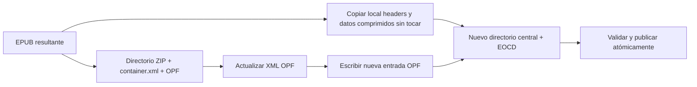

# PRD — Edición de metadata EPUB con I/O selectivo en ECC y EMAS

**Producto:** EPUB Cover Changer (ECC) y EPUB Merger & Splitter (EMAS)  
**Estado:** Implementado en Android (Fases 1–2); Fase 3 web pendiente  
**Ámbito:** `file-kit`, adaptadores de almacenamiento EPUB y flujo compartido de edición de metadata  
**Prioridad:** P1

## 1. Resumen

El editor compartido de metadata ya lee y escribe el EPUB resultante de ECC y EMAS. Su implementación actual usa `JSZip`: carga el archivo EPUB completo en memoria y, al guardar, descomprime y vuelve a comprimir todas las entradas del ZIP aunque solo cambie el OPF.

Este PRD define una ruta de I/O selectivo. La lectura debe recuperar únicamente el directorio ZIP, `META-INF/container.xml` y el OPF. El guardado debe crear un archivo EPUB de reemplazo copiando sin modificar los bytes comprimidos de cada entrada no afectada y regenerando únicamente el OPF y el directorio central. El resultado se publica de forma atómica sobre el archivo resultante, igual que Rename.

## 2. Problema

Editar título, autor o identificador de un EPUB no requiere leer imágenes, XHTML, fuentes ni otros recursos. Sin embargo, el flujo actual:

1. Lee el EPUB completo como `Uint8Array`.
2. Carga el ZIP entero con `JSZip.loadAsync`.
3. Lee `container.xml` y el OPF para mostrar el formulario.
4. Al guardar, itera todas las entradas, las descomprime y las vuelve a comprimir para generar un nuevo ZIP.

Esto escala con el tamaño total del libro, duplica presión de memoria y altera innecesariamente la compresión de recursos no relacionados. En Android, además, mueve un archivo grande por el bridge hacia JavaScript antes de poder editar una pequeña porción XML.

## 3. Objetivos

- Leer la metadata actual sin cargar el EPUB completo ni descomprimir entradas distintas de `container.xml` y el OPF.
- Guardar cambios sin descomprimir, transformar ni recomprimir XHTML, imágenes, fuentes, audio u otros recursos no modificados.
- Mantener el contrato actual: el editor modifica el EPUB resultante, nunca el archivo de entrada original.
- Aplicar la misma semántica en ECC y EMAS, tanto para resultados ya publicados como para el resultado temporal de ECC antes de exportarlo.
- Conservar compatibilidad EPUB 2 y EPUB 3, incluidos campos Dublin Core, roles, `file-as`, refinements EPUB 3 y `dcterms:modified`.
- Publicar el archivo de reemplazo de forma atómica o conservar el original intacto si la operación falla o se cancela.
- Medir bytes leídos, bytes escritos, tiempo y memoria para demostrar la mejora.

## 4. No objetivos

- Cambiar el formulario, campos soportados o traducciones del editor de metadata.
- Modificar portada, manifiesto, spine, XHTML ni otros recursos EPUB.
- Reparar EPUBs inválidos fuera de los errores necesarios para localizar o actualizar el OPF.
- Reescribir el archivo original seleccionado por la persona usuaria.
- Añadir red, backend o sincronización remota.
- Intentar un parche in-place del OPF dentro del ZIP. El tamaño comprimido puede variar y desplaza offsets posteriores; no es una estrategia segura ni requerida.

## 5. Usuarios y flujos afectados

| Producto | Archivo objetivo | Lectura | Guardado |
| --- | --- | --- | --- |
| ECC, resultado exportado | EPUB en Documents público | Metadata del archivo publicado | Reemplaza ese mismo resultado mediante publicación atómica |
| ECC, resultado aún no exportado | EPUB temporal en Data o bytes web | Metadata del resultado temporal | Actualiza el temporal; Rename/Save posterior publica esa versión |
| EMAS | EPUB resultante de la biblioteca | Metadata del archivo publicado | Reemplaza ese mismo resultado y actualiza índice de título/tamaño |

En ningún caso se cambia la fuente usada para generar el resultado.

## 6. Estado actual y evidencia técnica

`readEpubMetadata` carga el ZIP desde un `Uint8Array`, aunque luego solo abre `META-INF/container.xml` y el OPF. `writeEpubMetadata` vuelve a crear un ZIP y llama `entry.async('uint8array')` para cada entrada no `mimetype`; por tanto, procesa todo el documento para un cambio XML pequeño.

El límite actual de 128 MiB evita algunos picos, pero también impide editar metadata de EPUBs válidos mayores. No resuelve el coste estructural ni la transferencia completa a JavaScript.

## 7. Principios de diseño

1. **El OPF es el único payload editable.** `container.xml` solo se lee para localizarlo.
2. **Passthrough binario.** Las entradas no afectadas se copian con sus bytes comprimidos, flags, CRC, método de compresión, extras y orden originales.
3. **El directorio central se reconstruye.** Al cambiar la longitud del OPF, cambian offsets; se escribe un nuevo directorio central y EOCD/ZIP64 cuando corresponda.
4. **Sin bridge de archivos completos en Android.** Las operaciones ZIP viven en el motor nativo y usan streams/descriptores de archivo.
5. **Escritura transaccional.** Se escribe un sibling temporal, se valida y después se sustituye/publica. Un fallo deja el EPUB resultante anterior disponible.
6. **Fallback explícito.** Si el archivo usa una variante ZIP no soportada para passthrough, se informa una causa concreta; no se ejecuta silenciosamente un rewrite completo en JavaScript.

## 8. Arquitectura objetivo

### 8.1 Lectura selectiva

Crear un adaptador `EpubMetadataIo` con una operación de lectura basada en un origen de archivo, no en `Uint8Array`:

```ts
readMetadata(source: EpubFileSource): Promise<EpubMetadataDocument>;
```

El motor debe:

1. Leer EOCD desde el final del archivo y, cuando aplique, los registros ZIP64.
2. Leer solo el directorio central para localizar entradas por nombre normalizado.
3. Leer y descomprimir únicamente `META-INF/container.xml`.
4. Resolver la ruta del OPF y leer/descomprimir únicamente esa entrada.
5. Parsear el OPF y devolver el modelo actual del editor.

En web, `EpubFileSource` debe aprovechar `Blob.slice()` o `FileSystemFileHandle.getFile()` para rangos. En Android, el plugin nativo debe usar `FileChannel`/`RandomAccessFile` o el equivalente seguro de la plataforma. No se debe materializar el libro completo en JS.

### 8.2 Rewrite selectivo

```ts
writeMetadata(source: EpubFileSource, metadata: EpubPackageMetadata): Promise<EpubRewriteResult>;
```

El motor vuelve a leer el directorio central y el OPF, genera el OPF actualizado y escribe un archivo temporal:



Para cada entrada no OPF, se copian directamente desde el local header hasta el final de sus datos y descriptor opcional. No se invoca un descompresor ni compresor sobre esa entrada. Solo se serializa y comprime el OPF actualizado; `mimetype` permanece primero y sin compresión, tal como venía.

El resultado debe mantener nombres, orden de entradas, métodos de compresión, CRCs, flags y campos extra de las entradas pasantes. La metadata externa de archivo (nombre, MIME, URI de destino) conserva el comportamiento actual de ECC y EMAS.

### 8.3 Publicación por plataforma

| Plataforma | Escritura temporal | Publicación |
| --- | --- | --- |
| Android, resultado público | Data/Cache privado junto a la sesión | Adaptador existente publica sobre el mismo nombre; rollback si falla |
| Android, resultado ECC temporal | Reemplazo temporal privado | El Rename/Save posterior publica este archivo |
| Web con File System Access | Archivo temporal/stream del mismo directorio cuando sea posible | Reemplazo atómico si el navegador lo permite |
| Web sin escritura streaming | Fallback de memoria solo para archivos dentro de un presupuesto documentado | Descargar/guardar resultado como hoy |

El fallback web no puede ser el camino usado por Android.

## 9. Requisitos funcionales

### R1 — Lectura mínima

- Para mostrar el editor, el motor solo lee el directorio ZIP, `container.xml` y el OPF.
- No abre contenido, imágenes, fuentes ni portadas.
- Debe admitir OPF comprimido o almacenado, rutas con subdirectorios y container XML válido con ruta relativa normalizada.
- Un OPF ausente, XML inválido o ZIP corrupto produce un error localizado y no altera el resultado.

### R2 — Escritura segura de metadata

- El escritor conserva el modelo de metadata actual y actualiza únicamente el OPF.
- Debe preservar elementos OPF desconocidos que no pertenecen a los campos administrados por el formulario.
- Debe conservar EPUB 2 y EPUB 3, `unique-identifier`, refinements de personas y `dcterms:modified` en EPUB 3.
- Tras escribir, una lectura selectiva del nuevo archivo debe devolver exactamente los valores guardados.

### R3 — Integridad de entradas no modificadas

- Cada entrada no OPF debe conservar exactamente sus bytes comprimidos y su CRC original.
- El orden de entradas debe conservarse.
- Si el archivo usa ZIP64, data descriptors, entradas con extras o métodos no estándar, el motor debe conservarlos por passthrough cuando el formato sea soportado.
- Entradas cifradas o variantes ZIP que el motor no pueda copiar con seguridad se rechazan con `UNSUPPORTED_ZIP_LAYOUT`; no se modifica el archivo.

### R4 — Atomicidad y recuperación

- Nunca sobrescribir el resultado de origen mientras el archivo de reemplazo no haya terminado y pasado validación.
- Validación mínima: EOCD válido, OPF localizable, OPF XML válido, lectura de metadata equivalente a la solicitud y tamaños/CRCs coherentes del directorio central.
- Al fallar, eliminar solo el temporal propio y mantener el archivo anterior.
- La cancelación debe comprobarse entre entradas copiadas y antes de publicar.

### R5 — Integración de apps

- ECC conserva sus ramas actualizadas: archivo publicado, temporal nativo y bytes/archivo web.
- EMAS conserva la actualización del índice de biblioteca después de publicar el EPUB modificado.
- Rename y Edit metadata deben poder ejecutarse en cualquier orden sobre el mismo resultado sin perder cambios.

## 10. Requisitos no funcionales y métricas

### Presupuestos

- Android: memoria adicional de lectura inferior a 8 MiB para EPUBs cuyo OPF sea menor de 2 MiB; la memoria no crece con imágenes o XHTML del libro.
- Android: rewrite con buffers fijos configurables, objetivo máximo de 1 MiB adicional excluyendo buffers del sistema operativo.
- No existe límite funcional de tamaño de EPUB para la ruta nativa por el solo hecho de editar metadata. Los límites físicos se comunican explícitamente.

### Instrumentación local de desarrollo

Registrar sin contenido ni rutas personales:

- tamaño total del EPUB;
- bytes leídos para mostrar el editor;
- bytes leídos y escritos al guardar;
- número de entradas copiadas en passthrough;
- número de entradas descomprimidas y recomprimidas (debe ser uno: OPF);
- tiempo de índice, lectura OPF, copia, compresión OPF, validación y publicación;
- máximo de memoria de trabajo;
- ruta usada: native selective, web selective o fallback web.

### Criterios de rendimiento

Con una línea base del flujo JSZip actual en al menos dos dispositivos Android:

- Lectura: reducir en al menos 90% los bytes de contenido descomprimidos para EPUBs con OPF menor de 2 MiB.
- Lectura: no transferir el EPUB completo al bridge JavaScript en Android.
- Escritura: descomprimir y recomprimir solo el OPF; cero entradas de contenido deben recomprimirse.
- Memoria: evitar un buffer completo del EPUB y permitir editar un EPUB de más de 128 MiB cuando el almacenamiento del dispositivo lo soporte.
- Correctitud: el hash de datos comprimidos de toda entrada no OPF coincide antes y después del rewrite.

## 11. Compatibilidad y casos límite

El corpus obligatorio incluye:

| Caso | Validación |
| --- | --- |
| EPUB 2 válido | campos DC, rol y `file-as` |
| EPUB 3 válido | refinements, identificador y `dcterms:modified` |
| OPF en subdirectorio | resolución por `container.xml` |
| EPUB con imágenes/fuentes grandes | lectura mínima y passthrough binario |
| EPUB con miles de entradas | directorio central y copia incremental |
| ZIP64 | offsets y directorio ZIP64 |
| Data descriptors/extras | copia y directorio correctos |
| OPF con metadata desconocida | preservación |
| Cancelación y espacio insuficiente | original intacto y temporal limpio |
| Rename antes/después de editar | mismo resultado, sin pérdida de metadata |

## 12. Plan de implementación

### Fase 0 — Contrato y línea base

- Añadir métricas al flujo actual de `file-kit` sin cambiar comportamiento.
- Construir corpus de EPUBs y pruebas de equivalencia de metadata.
- Definir `EpubFileSource`, resultados de error y contrato de cancelación.

### Fase 1 — Motor selectivo Android

- Implementar lector de directorio ZIP, `container.xml` y OPF sobre archivo local.
- Implementar writer de passthrough y directorio central/ZIP64.
- Añadir validación, publicación atómica y limpieza de temporales.
- Exponer operaciones nativas a `file-kit`; eliminar el traslado completo de bytes a JavaScript para Android.

### Fase 2 — Integración ECC y EMAS

- Sustituir las llamadas actuales de lectura/escritura de metadata por el adaptador selectivo.
- Mantener las tres rutas ECC y actualizar el índice EMAS tras éxito.
- Probar interacción Rename/Edit metadata en ambos órdenes.

### Fase 3 — Web y fallback controlado

- Implementar lectura por rangos y escritura streaming cuando las APIs del navegador estén disponibles.
- Mantener el fallback actual solo bajo un presupuesto explícito y con mensaje de error cuando no sea seguro.

### Fase 4 — Benchmark y rollout

- Ejecutar corpus en dispositivos físicos Android.
- Comparar bytes, tiempo y memoria contra línea base.
- Activar primero en builds internas con métricas; promover tras equivalencia e integridad verificadas.

## 13. Criterios de aceptación

- Abrir Edit metadata de un resultado ECC o EMAS no lee ni descomprime el libro completo.
- Guardar metadata no descomprime ni recompime ninguna entrada distinta del OPF.
- El resultado continúa siendo un EPUB válido y contiene los valores guardados.
- Las entradas no OPF conservan sus bytes comprimidos exactamente.
- El archivo objetivo sigue siendo el resultado/export, no el original de entrada.
- Un error, falta de espacio o cancelación conserva el archivo resultante anterior.
- ECC y EMAS pasan sus pruebas de flujo, metadata, rename y actualización de biblioteca.
- Los benchmarks cumplen los criterios de rendimiento y memoria definidos.

## 14. Riesgos y mitigaciones

| Riesgo | Mitigación |
| --- | --- |
| Implementar ZIP/ZIP64 manualmente introduce errores de formato | parser/writer aislado, corpus amplio, validación tras escritura y pruebas con herramientas ZIP externas |
| Algunos layouts ZIP no permiten passthrough seguro | rechazo explícito con causa; nunca fallback silencioso que cargue el libro completo |
| Reemplazo de archivo falla al final | temporal validado, publicación atómica y conservación del original |
| Soporte web inconsistente | ruta streaming cuando exista, fallback con presupuesto y mensajes claros |
| Metadata existente compleja se pierde | pruebas de preservación de XML no administrado y equivalencia EPUB 2/3 |

## 15. Estado de implementación actual

- Fases 1–2 implementadas: motor Android selectivo, passthrough de entradas, validación, publicación segura y wiring de ECC/EMAS.
- La ruta Android pública usa un staging comprimido en cache para leer/escribir MediaStore sin transportar el EPUB por JavaScript; el parseo y rewrite selectivo ocurren nativamente.
- La ruta web conserva el fallback JSZip existente hasta implementar rangos/streaming del navegador.
- Métricas de dispositivo físico y corpus ampliado quedan pendientes de la Fase 4.

## 16. Definición de terminado

La optimización está terminada cuando ECC y EMAS editan metadata sobre sus EPUBs resultantes usando lectura selectiva y rewrite de passthrough; Android no transporta ni retiene el archivo completo en JavaScript; el OPF es la única entrada transformada; las entradas restantes conservan sus bytes comprimidos; la publicación es recuperable; y los benchmarks y pruebas de integración demuestran equivalencia funcional y mejora de I/O/memoria.
